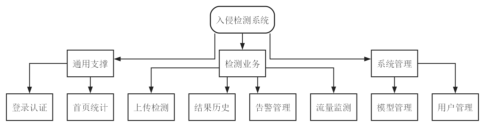
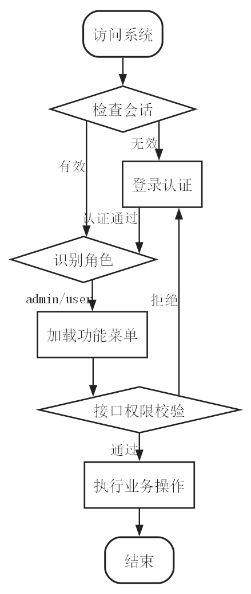
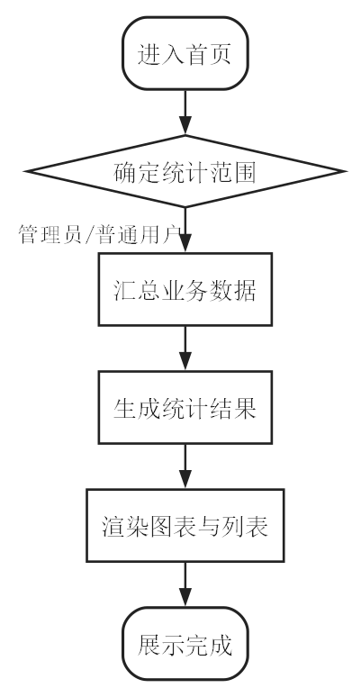
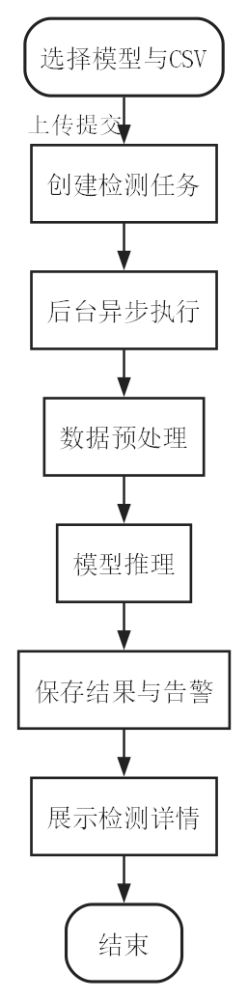
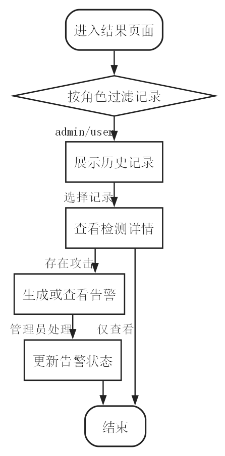
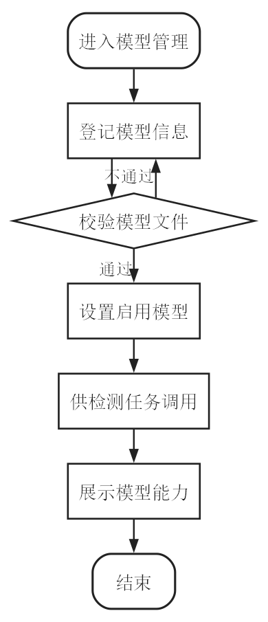
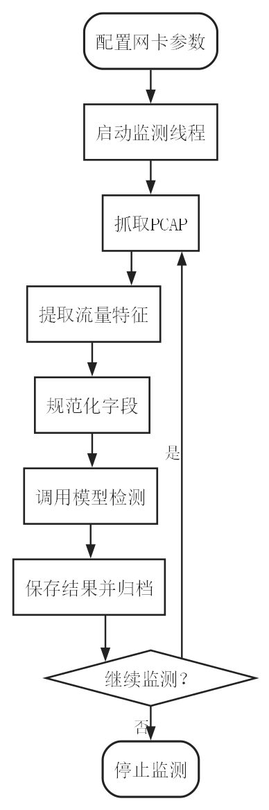
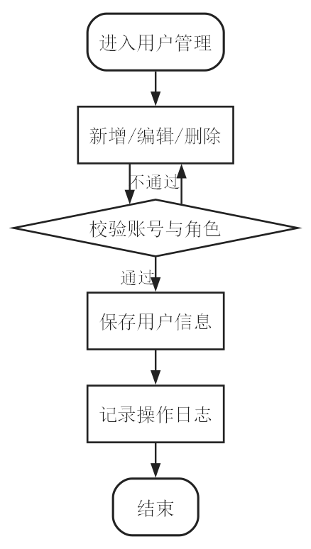

> 使用说明：本文稿按当前项目代码重新整理，用于替换 `.docx` 中仍混有旧项目内容的“4.3 核心功能模块详细设计”。如果论文前文仍保留“4.3 入侵检测模型设计”，则需要将本节编号顺延为“4.4”，并同步调整图号。

# 4.3 核心功能模块详细设计

结合当前项目的实际实现，系统采用 Flask、Vue 3、MySQL 与 PyTorch 组成的 B/S 架构，围绕网络流量检测、结果归档、告警管理和平台维护等业务需求进行模块化设计。当前项目已经将在线流量处理链路调整为 Scapy 抓包、Python cicflowmeter 特征提取和深度学习模型检测的纯 Python 流程，减少了对外部 Java 运行环境的依赖，使流量采集、特征处理、模型推理和结果保存能够在同一后端系统中完成。

从功能结构上看，系统主要划分为登录认证与权限控制、系统首页与统计展示、数据上传与后台检测任务、检测结果与历史记录、告警管理、模型管理与模型能力展示、实时流量监测、用户管理与操作审计等八个核心模块。各模块之间通过用户会话、模型信息、检测任务、检测记录、攻击结果和告警日志等数据进行关联，共同构成完整的网络入侵检测业务流程。系统核心功能模块划分如图4.3-1所示。



## 4.3.1 登录认证与权限控制模块

登录认证与权限控制模块是系统的入口模块，主要负责用户身份验证、角色识别、会话保持和访问控制。用户进入系统时，系统首先判断当前是否存在有效登录状态；若登录状态有效，则进入系统主界面；若登录状态无效，则跳转到登录页面，要求用户输入账号和密码完成身份认证。

认证通过后，系统根据用户角色加载不同的功能菜单。普通用户主要使用上传检测、结果查看和历史记录查询等功能；管理员除具备普通用户权限外，还可以进入模型管理、用户管理、告警管理和实时流量监测等管理模块。对于涉及敏感操作的功能，系统在后端进行统一权限校验，防止普通用户访问管理员功能。同时，系统会根据用户身份限制检测记录和告警信息的可见范围，管理员可以查看全平台数据，普通用户只能查看本人相关数据。登录认证与权限控制流程如图4.3-2所示。



## 4.3.2 系统首页与统计展示模块

系统首页与统计展示模块用于集中展示平台运行状态和检测概况。用户登录后，系统根据当前角色确定统计范围：管理员查看系统整体统计数据，普通用户查看个人检测任务相关数据。该模块能够帮助用户快速了解系统当前检测规模、异常流量分布和近期运行情况。

首页统计内容主要包括检测记录数量、告警数量、累计检测样本数、攻击样本数、正常样本数、攻击类型分布、近期攻击趋势、最近检测记录和最近告警信息等。后端对相关业务数据进行聚合计算后，将统计结果返回前端；前端再通过统计卡片、饼图、折线图和列表等形式进行展示。系统首页统计展示流程如图4.3-3所示。



## 4.3.3 数据上传与后台检测任务模块

数据上传与后台检测任务模块是系统的核心业务模块，负责完成从流量特征文件上传、任务创建、后台检测到结果保存的完整流程。当前系统支持上传符合 CIC-IDS 风格字段格式的 CSV 文件，并允许用户选择已注册模型执行检测。考虑到流量文件可能包含较多样本，系统采用后台异步任务机制执行检测，避免前端页面长时间等待。

用户进入上传检测页面后，首先选择检测模型和待检测 CSV 文件。系统接收到文件后，会对文件类型进行校验，并将文件保存到指定目录，同时记录文件来源、样本规模和任务状态。任务创建完成后，系统启动后台检测流程，并向前端返回任务状态。前端通过定时刷新方式展示任务进度，任务完成后自动进入检测结果详情页面。

后台检测过程中，系统先对数据进行预处理，包括字段清洗、缺失值处理、特征补齐、标准化和模型输入格式转换等步骤；随后调用深度学习模型进行推理，得到每条流量样本的预测类别和置信度。对于正常流量，系统计入正常样本统计；对于攻击流量，系统记录攻击类型、风险等级和相关地址信息，并同步生成告警。检测完成后，系统保存检测记录、攻击结果和告警信息，形成可追溯的检测结果。数据上传与检测任务流程如图4.3-4所示。



## 4.3.4 检测结果与历史记录模块

检测结果与历史记录模块用于展示检测任务完成后的结果信息，并支持用户回溯历史检测记录。用户进入结果页面后，系统根据角色加载可见范围内的检测记录。普通用户只能查看本人提交的检测任务，管理员可以查看所有用户的检测记录。

检测记录列表主要展示源文件名、样本总数、攻击样本数、检测时间、操作者和检测状态等信息。用户可以通过关键词对历史记录进行筛选，并点击具体记录查看检测详情。详情页面进一步展示本次检测的统计结果和攻击样本明细，包括攻击类型、风险等级、置信度、源地址和目的地址等信息。对于管理员，系统还提供必要的记录管理能力，以便清理无效或测试数据。检测结果展示与告警处理流程如图4.3-5所示。



## 4.3.5 告警管理模块

告警管理模块用于管理系统检测过程中产生的异常流量告警信息。当模型识别到攻击流量时，系统会根据检测结果生成告警记录，告警内容包括攻击类型、风险等级、处理状态、创建时间和关联检测记录等信息。该模块将模型输出进一步转化为面向安全运维的事件信息，便于管理员进行后续处置。

管理员进入告警管理页面后，可以查看告警列表，并根据处理状态筛选告警。对于需要处置的告警，管理员可以结合检测详情判断其风险程度，并将告警状态更新为已处理或忽略。通过这种方式，系统能够形成从“发现异常”到“查看详情”再到“完成处置”的闭环流程。该模块与检测结果模块共同构成结果分析与告警处置链路，其流程已在图4.3-5中展示。

## 4.3.6 模型管理与模型能力展示模块

模型管理与模型能力展示模块用于维护系统接入的深度学习模型，并向用户展示模型的基本能力和输入要求。管理员可以在该模块中登记模型名称、模型文件、模型类型、评价指标、数据格式说明和输入字段要求等信息。系统在保存模型前会校验模型信息的完整性和模型文件的可用性，避免无效模型进入检测流程。

系统采用当前启用模型机制，保证离线检测任务和在线流量监测始终使用明确的模型版本。管理员可以根据实验结果或系统需要切换当前启用模型；普通用户在上传检测前，也可以查看模型能力说明，了解模型指标、数据格式要求和所需字段。该模块既提高了系统的可维护性，也为后续扩展不同深度学习模型提供了接口。模型管理流程如图4.3-6所示。



## 4.3.7 实时流量监测模块

实时流量监测模块是当前项目环境变化后重点调整的模块。该模块面向管理员开放，用于实现在线流量采集、特征提取、字段规范化、自动检测和结果归档。与离线 CSV 检测不同，实时流量监测模块从网络接口直接采集数据，并将原始数据转换为模型可识别的流量特征。

管理员在使用该模块时，首先配置抓包网卡和监测参数，然后启动监测线程。系统通过 Scapy 抓取网络数据并生成 PCAP 文件，再通过 Python cicflowmeter 提取流量特征。由于在线提取字段与训练数据字段存在差异，系统会在送检前执行字段规范化处理，使在线流量数据与模型训练阶段的数据格式保持一致。若提取结果中存在有效流量，系统会调用当前启用模型完成检测，并保存检测记录、攻击结果和告警信息；若没有有效流量，则只进行文件归档和状态记录。实时流量监测流程如图4.3-7所示。



## 4.3.8 用户管理与操作审计模块

用户管理与操作审计模块用于维护系统账号和角色信息，是多用户使用和权限隔离的基础。该模块仅对管理员开放，主要提供用户列表查看、新增用户、编辑用户和删除用户等功能。

管理员新增或修改用户时，系统会对用户名、密码和角色信息进行校验，保证用户名不重复、角色设置合法、密码满足基本要求。用户密码在保存前会进行安全处理，避免直接存储明文密码。对于删除操作，系统会限制管理员删除当前登录账号，并检查目标用户是否存在关联检测记录，以保证历史数据可追溯。用户管理过程中的关键操作会写入操作日志，为后续问题定位和安全审计提供依据。用户管理流程如图4.3-8所示。



## 图文件对应关系

| 图号 | 图名 | 文件路径 |
| --- | --- | --- |
| 图4.3-1 | 核心功能模块划分图 | `thesis_figures/4_3_bw_flowcharts/fig4-3-bw-1-module-structure.png` |
| 图4.3-2 | 登录认证与权限控制流程图 | `thesis_figures/4_3_bw_flowcharts/fig4-3-bw-2-login-permission.png` |
| 图4.3-3 | 系统首页统计展示流程图 | `thesis_figures/4_3_bw_flowcharts/fig4-3-bw-3-dashboard-stats.png` |
| 图4.3-4 | 数据上传与检测任务流程图 | `thesis_figures/4_3_bw_flowcharts/fig4-3-bw-4-offline-detection.png` |
| 图4.3-5 | 结果展示与告警处理流程图 | `thesis_figures/4_3_bw_flowcharts/fig4-3-bw-5-result-alarm.png` |
| 图4.3-6 | 模型管理流程图 | `thesis_figures/4_3_bw_flowcharts/fig4-3-bw-6-model-management.png` |
| 图4.3-7 | 实时流量监测流程图 | `thesis_figures/4_3_bw_flowcharts/fig4-3-bw-7-traffic-monitoring.png` |
| 图4.3-8 | 用户管理流程图 | `thesis_figures/4_3_bw_flowcharts/fig4-3-bw-8-user-management.png` |

## 绘图脚本

上述黑白流程图由根目录脚本 `generate_chapter4_3_bw_flowcharts.py` 生成。脚本会在 `thesis_figures/4_3_bw_flowcharts/` 下同时输出 PNG 图和 DOT 源文件，后续如需调整节点文字或流程，只需修改脚本后重新运行：

```powershell
.\.venv\Scripts\python.exe generate_chapter4_3_bw_flowcharts.py
```
